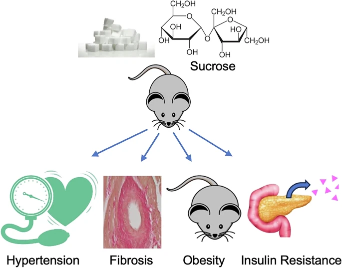

> [!WARNING]  
> This document is work in progress and many changes will be made, the information in this document may not always be reliable.

> [!NOTE]
> I chose to write about this as it is one of the most widely consumed dietary sugars that affects the human body in many different ways.

## Research on rodents

PubMed wrote about research conducted by **Nakayama Y, Utsunomiya H, Eguchi K, Elliott KJ, Hashimoto T, Osei-Owusu P and Eguchi S** covering how sucrose affects the [mouse model](https://www.nature.com/articles/s41440-025-02278-w).

[[Image Source]](https://www.nature.com/articles/s41440-025-02278-w)

In mice with a high sucrose diet, hallmarks of metabolic syndrome were observed including weight gain, insulin resistance, ~15 mmHg elevation in blood pressure, and systemic inflammation.

Humans also do not take sugar well as they experience elevated plasma glucose, insulin, and lipid levels, particularly in individuals with obesity. [[Source]](https://pmc.ncbi.nlm.nih.gov/articles/PMC12535405/)

Although long-term epidemiological data are limited, a recent study demonstrated that sucrose intake increased the risk for hypertension in women. [[Source]](https://pmc.ncbi.nlm.nih.gov/articles/PMC9813634/)

## Effect on the human body

Sucrose provides a high source of energy for humans with nutritional benefits.

When consumed at high quantity or frequency, it creates a health risk for obesity, diabetes, and hyperlipidemia. (See Research on rodents.)

**Lone B Sørensen, Anne Raben, Steen Stender and Arne Astrup** conducted an observational study in which overweight men and women were given supplements containing sucrose or artificial sweeteners for 10 weeks. High intake of sucrose was shown to increase body weight and elevate certain inflammatory markers compared to artificial sweeteners. [[Source]](https://pubmed.ncbi.nlm.nih.gov/16087988/)

These changes occurred even after adjusting for body weight and energy intake, suggesting a direct influence of sucrose on inflammation.

A sucrose-rich diet led to weight gain, higher glucose, insulin, and lipid levels in controlled trials. This indicates a greater metabolic burden and potential risk for diabetes and cardiovascular diseases induced by excess sucrose consumption, especially with high-risk individuals. [[Source]](https://pmc.ncbi.nlm.nih.gov/articles/PMC12535405/#S15)

---

### Sources
- https://pmc.ncbi.nlm.nih.gov/articles/PMC12535405/
- https://pmc.ncbi.nlm.nih.gov/articles/PMC9813634/
- https://pubmed.ncbi.nlm.nih.gov/16087988/